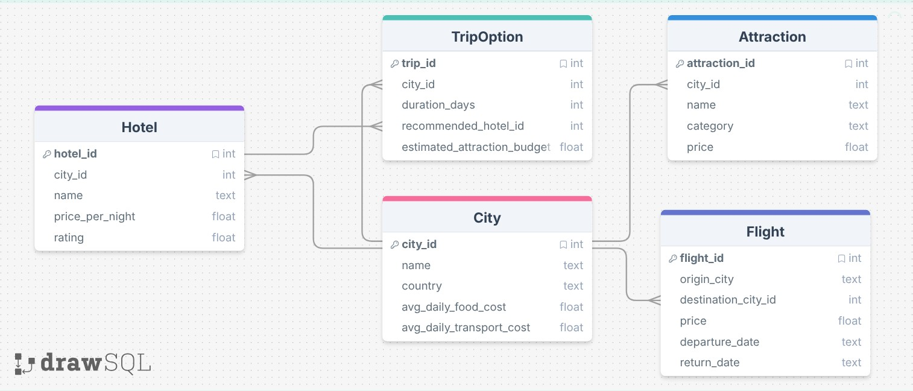

# Natural Language Travel Planner

A CLI tool that lets you query a travel database using plain English. It translates your questions into SQL using OpenAI, runs the query against a local SQLite database, and returns a natural language answer.



## Setup

### Prerequisites

- Go 1.21+
- An [OpenAI API key](https://platform.openai.com/api-keys)

### Installation

1. Clone the repo:

```bash
git clone https://github.com/yourusername/natural-lang-travel-planner.git
cd natural-lang-travel-planner
```

1. Install dependencies:

```bash
go mod tidy
```

1. Set up the database:

```bash
sqlite3 travel.db < schema.sql
sqlite3 travel.db < seed.sql
```

1. Configure your API key:

```bash
cp .env.example .env
```

Then edit `.env` and add your OpenAI API key.

## Usage

```bash
go run .
```

Then type a question in plain English:

```
Natural Language Travel Query System (type 'exit' to quit)

> What are the cheapest flights to Tokyo?

--- SQL ---
SELECT * FROM Flight WHERE destination_city_id = (SELECT city_id FROM City WHERE name = 'Tokyo') ORDER BY price ASC LIMIT 20;

--- Answer ---
The cheapest flight to Tokyo costs $450, departing on 2025-06-15 with a return on 2025-06-22.
```

Type `exit` to quit.

## Project Structure

```
├── main.go        # Entry point and REPL loop
├── openai.go      # OpenAI API calls (SQL generation + answer streaming)
├── db.go          # SQLite database initialization
├── query.go       # Executes SQL and converts results to JSON
├── helpers.go     # SQL extraction and safety checks
├── schema.sql     # Database schema
├── seed.sql       # Sample travel data
└── assets/        # Diagrams and images
```
